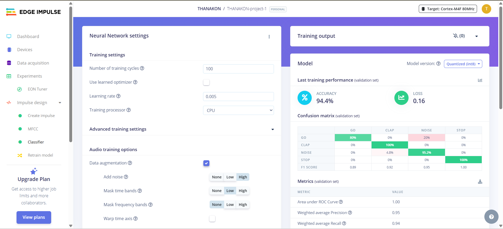

# edge-ai-voice-classifier-thanakon
# Edge AI Contest Submission: Simple Voice Command Classifier
**Project Name:** THANAKON-project-1 | **Developer:** bankwwe

## 1. Project Goal & Overview
This project aims to classify three distinct voice commands (GO, STOP, CLAP) and background noise (NOISE) on an Edge Device (mobile phone/web browser). The final model achieved a high validation accuracy of 94.4%.

## 2. Model Architecture & Training Summary
* **Impulse:** Audio (MFCC) feature extraction combined with a 1D Convolutional Neural Network (CNN) Classifier.
* **Data Balance:** 90 NOISE samples were strategically included to ensure the model's robustness and minimize false positives from background noise (Total 180 Training / 58 Test Samples).

### Final Model Performance (Validation Set)
**Overall Accuracy:** **94.4%**

### Detailed Class Breakdown

| Class | Accuracy (Recall) | Main Error | Note |
| :--- | :--- | :--- | :--- |
| **STOP** | 100% | None | The model achieved perfect accuracy for this command. |
| **CLAP** | 100% | None | The model achieved perfect accuracy after data adjustments. |
| **NOISE** | 95.2% | 4.8% Classified as CLAP | The model demonstrates high resilience to background noise. |
| **GO** | 80% | 20% Classified as NOISE | This was the most confused class, often mistaken for NOISE. |

## 3. Deployment and Demonstration
* **Deployment Method:** Live Classification via Web Browser, using Mobile Phone Microphone (phone_mibrpgvy).
* **Link to Edge Impulse Project:** [Insert your Edge Impulse project link here]
* **Link to Demo Video:** **[[Pending - Insert your YouTube link here after recording](https://youtu.be/1-aV8FMdSlU)]**
